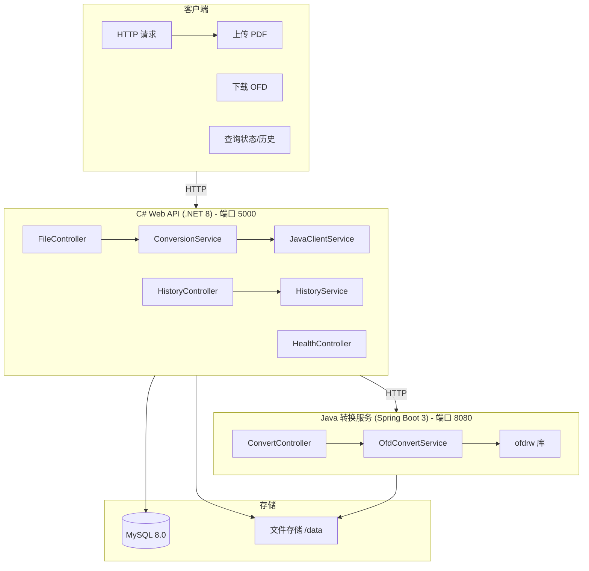
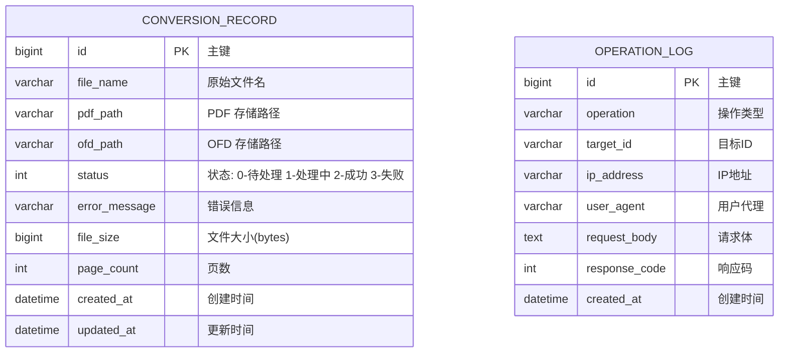

# PDF 转 OFD 转换系统 - 项目设计文档

## 1. 系统架构



## 2. ER 图



## 3. 接口清单

### 3.1 C# Web API (端口 5000)

#### FileController
| 方法 | 路径 | 描述 |
|------|------|------|
| POST | `/api/file/upload` | 上传 PDF 文件并转换 |
| GET | `/api/file/download/{id}` | 下载 OFD 文件 |
| GET | `/api/file/status/{id}` | 查询转换状态 |

#### HistoryController
| 方法 | 路径 | 描述 |
|------|------|------|
| GET | `/api/history` | 获取转换历史列表 |
| DELETE | `/api/history/{id}` | 删除历史记录 |

#### HealthController
| 方法 | 路径 | 描述 |
|------|------|------|
| GET | `/api/health` | 健康检查 |

### 3.2 Java 转换服务 (端口 8080，内部服务)

#### ConvertController
| 方法 | 路径 | 描述 |
|------|------|------|
| POST | `/api/convert` | 执行 PDF 转 OFD |
| GET | `/api/health` | 健康检查 |

## 4. 技术栈

| 层级 | 技术 | 版本 |
|------|------|------|
| C# API | .NET 8 + ASP.NET Core + EF Core | .NET 8.0 |
| Java 服务 | Spring Boot 3 + ofdrw | Spring Boot 3.2+ |
| 数据库 | MySQL | 8.0 |
| 容器化 | Docker + Docker Compose | Latest |

## 5. 目录结构

```
label-00613/
├── docker-compose.yml
├── .gitignore
├── README.md
├── docs/
│   └── project_design.md
├── backend-csharp/
│   ├── Dockerfile
│   └── PdfToOfd.Api/
│       ├── Controllers/
│       ├── Services/
│       ├── Models/
│       ├── Data/
│       └── ...
└── backend-java/
    ├── Dockerfile
    ├── pom.xml
    └── src/
```
